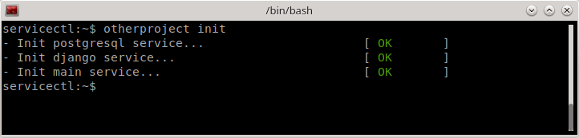
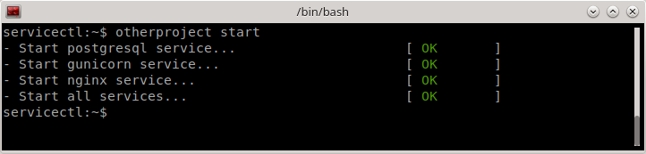
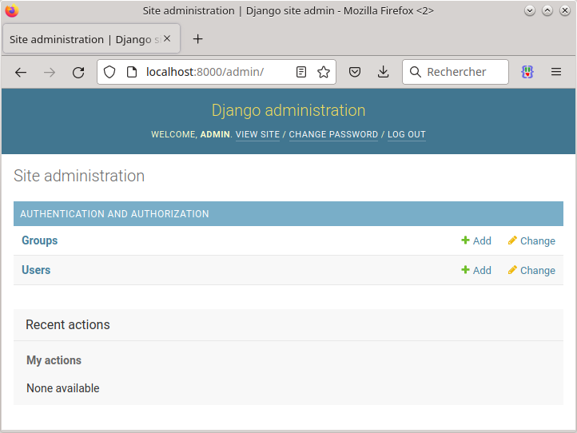

Small example of a django server using nginx, gunicorn and postgresql.

Install
-------

```python
python setup.py install
```


Init database
-------------




Start server
------------




Launch in your browser
----------------------


