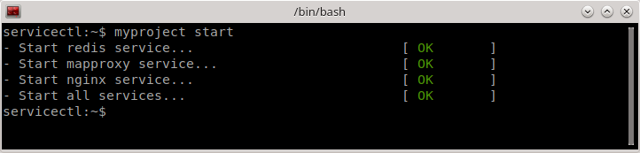
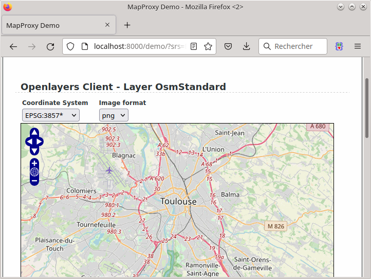

Small example of an mapproxy server using nginx, uwsgi and redis.

Install
-------

```python
python setup.py install
```


Start server
------------




Launch in your browser
----------------------


